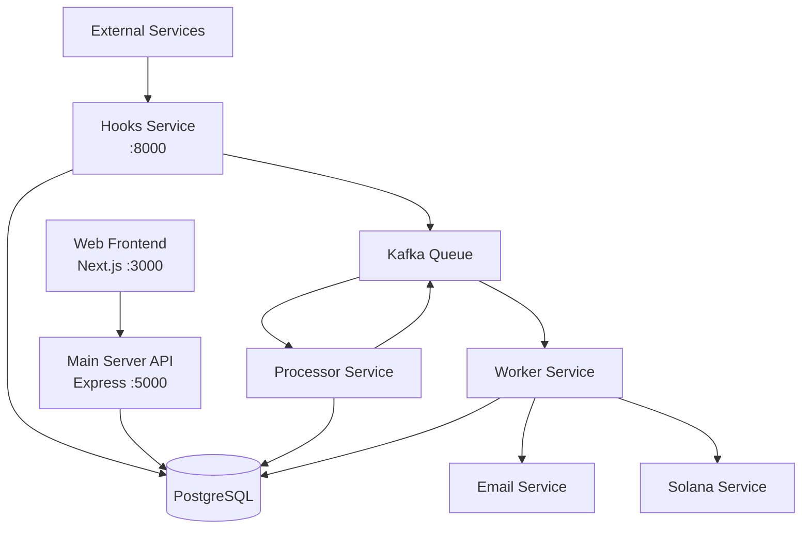
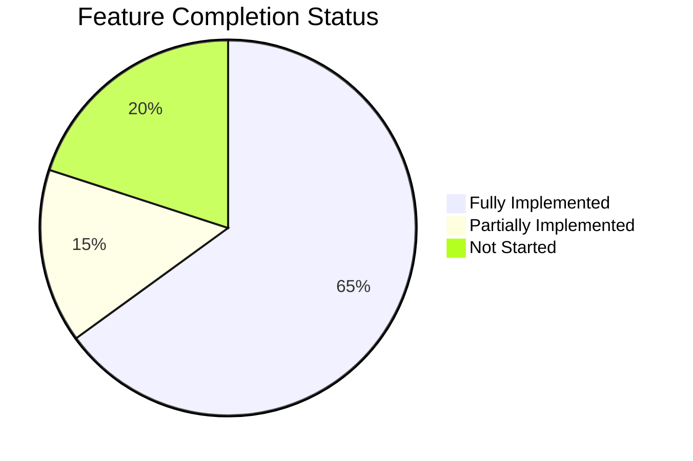

# ZapMate Project Analysis

A comprehensive analysis of the ZapMate workflow automation platform, documenting implemented features and areas requiring development.

---

## 📊 Project Overview

ZapMate is a **Zapier clone** built with microservices architecture, enabling users to create automated workflows ("Zaps") that connect triggers with actions.

---

## ✅ Implemented Features

### Backend Services

| Service | Status | Description |
|---------|--------|-------------|
| **Main Server** (port 5000) | ✅ Complete | Express API with auth, CRUD for Zaps |
| **Hooks Service** (port 8000) | ✅ Complete | Webhook endpoint handling with outbox pattern |
| **Processor Service** | ✅ Complete | Kafka producer, polls outbox table |
| **Worker Service** | ✅ Complete | Kafka consumer, executes Email & Solana actions |

---

### Authentication System

| Feature | Status | Location |
|---------|--------|----------|
| User Signup | ✅ | [AuthController.ts](file:///f:/vscode_programs/harkirat2.0/ZapMate/apps/server/src/controllers/AuthController.ts#L9-63) |
| User Signin | ✅ | [AuthController.ts](file:///f:/vscode_programs/harkirat2.0/ZapMate/apps/server/src/controllers/AuthController.ts#L65-109) |
| JWT Token Generation | ✅ | Uses `jsonwebtoken` library |
| Password Hashing | ✅ | Uses `bcrypt` |
| Get User Details | ✅ | [AuthController.ts](file:///f:/vscode_programs/harkirat2.0/ZapMate/apps/server/src/controllers/AuthController.ts#L111-131) |
| Welcome Email | ✅ | Sends confirmation on signup |

---

### Zap Management (CRUD)

| Feature | Status | Description |
|---------|--------|-------------|
| Create Zap | ✅ | With trigger and multiple actions |
| List Zaps | ✅ | Paginated with relations |
| Get Zap by ID | ✅ | With trigger and actions |
| Update Zap | ✅ | Full update support |
| Rename Zap | ✅ | Patch endpoint |
| Delete Zap | ✅ | Cascading deletes |
| Enable/Disable Zap | ✅ | Toggle `isActive` flag |

---

### Trigger Types

| Trigger | Status | Notes |
|---------|--------|-------|
| **Webhook** | ✅ | Via `/hooks/:userId/:zapId` endpoint |
| **Gmail New Email** | ✅ | Full OAuth integration |
| **Gmail Labeled** | ✅ | Watch specific labels |
| **Gmail Starred** | ✅ | Watch starred emails |
| **Gmail Moved** | ✅ | Watch moved emails |

---

### Action Types

| Action | Status | Implementation Details |
|--------|--------|----------------------|
| **Email (SMTP)** | ✅ | Full implementation with templates |
| **Solana** | ⚠️ Partial | Placeholder - logs only, no actual transactions |
| **Gmail Send** | ✅ | OAuth authenticated sending |
| **Gmail Reply** | ✅ | Reply to threads |
| **Gmail Add Label** | ✅ | Add labels to emails |
| **Gmail Remove Label** | ✅ | Remove labels from emails |
| **Gmail Mark Read** | ✅ | Mark as read/unread |
| **Gmail Archive** | ✅ | Archive emails |

---

### Gmail Integration (MCP Server)

| Feature | Status | Location |
|---------|--------|----------|
| OAuth Flow | ✅ | [GmailController.ts](file:///f:/vscode_programs/harkirat2.0/ZapMate/apps/server/src/controllers/GmailController.ts) |
| Server Configuration | ✅ | Full CRUD for Gmail servers |
| Webhook Watch | ✅ | Gmail push notifications |
| Rate Limiting | ✅ | [GmailRateLimiter.ts](file:///f:/vscode_programs/harkirat2.0/ZapMate/apps/server/src/services/GmailRateLimiter.ts) |
| Error Handling | ✅ | [GmailErrorHandler.ts](file:///f:/vscode_programs/harkirat2.0/ZapMate/apps/server/src/services/GmailErrorHandler.ts) |
| Circuit Breaker | ✅ | Reset endpoint available |

---

### Frontend (Next.js)

| Page/Feature | Status | Location |
|--------------|--------|----------|
| Homepage | ✅ | [page.tsx](file:///f:/vscode_programs/harkirat2.0/ZapMate/apps/web/app/page.tsx) |
| Login Page | ✅ | `/login` route |
| Signup Page | ✅ | `/sign-up` route |
| Dashboard | ✅ | [dashboard/page.tsx](file:///f:/vscode_programs/harkirat2.0/ZapMate/apps/web/app/dashboard/page.tsx) |
| Zap Editor | ✅ | [editor/page.tsx](file:///f:/vscode_programs/harkirat2.0/ZapMate/apps/web/app/editor/page.tsx) |
| Gmail Dashboard | ✅ | `/gmail` route |
| 404 Page | ✅ | Custom not-found page |

---

### UI Components

| Component | Status | Purpose |
|-----------|--------|---------|
| `AuthForm` | ✅ | Reusable login/signup form |
| `Button` | ✅ | Primary/secondary variants |
| `FormInput` | ✅ | Styled input component |
| `Modal` | ✅ | Trigger/action selection modal |
| `Navbar` | ✅ | Navigation with auth state |
| `PublishZap` | ✅ | Zap creation/editing flow |
| `ZapCell` | ✅ | Individual trigger/action cell |
| `Tooltip` | ✅ | Hover tooltips |
| `Spinner` | ✅ | Loading indicator |
| `GmailTriggerConfig` | ✅ | Gmail trigger setup |
| `GmailActionConfig` | ✅ | Gmail action setup |
| `GmailServerConfig` | ✅ | Gmail OAuth config |
| `GmailStatusMonitor` | ✅ | Gmail connection status |
| `GmailDashboard` | ✅ | Gmail management UI |

---

### Database Schema

| Model | Status | Purpose |
|-------|--------|---------|
| `User` | ✅ | User accounts |
| `Zap` | ✅ | Workflow definitions |
| `AvailableTriggers` | ✅ | Trigger catalog |
| `Trigger` | ✅ | Zap trigger instances |
| `AvailableActions` | ✅ | Action catalog |
| `Action` | ✅ | Zap action instances |
| `ZapRun` | ✅ | Execution records |
| `ZapRunOutbox` | ✅ | Transactional outbox |
| `GmailServer` | ✅ | Gmail OAuth configs |
| `GmailTrigger` | ✅ | Gmail trigger instances |
| `GmailAction` | ✅ | Gmail action instances |
| `GmailWatch` | ✅ | Gmail webhook history |

---

### Shared Packages

| Package | Status | Purpose |
|---------|--------|---------|
| `@repo/db` | ✅ | Prisma client & schema |
| `@repo/email` | ✅ | Nodemailer with templates |
| `@repo/kafka` | ✅ | Kafka client config |
| `@repo/types` | ✅ | Zod schemas & TypeScript types |
| `@repo/ui` | ✅ | Shared UI components |
| `@repo/eslint-config` | ✅ | Shared ESLint rules |
| `@repo/typescript-config` | ✅ | Shared TS configs |

---

### Testing

| Test Type | Status | Location |
|-----------|--------|----------|
| Auth Tests | ✅ | [tests/auth/](file:///f:/vscode_programs/harkirat2.0/ZapMate/apps/server/tests/auth) |
| Gmail Integration Tests | ✅ | [test-gmail-integration.ts](file:///f:/vscode_programs/harkirat2.0/ZapMate/apps/server/src/test-gmail-integration.ts) |
| Webhook Tests | ✅ | [test-webhook.ts](file:///f:/vscode_programs/harkirat2.0/ZapMate/apps/server/src/test-webhook.ts) |
| Jest Config | ✅ | [jest.config.js](file:///f:/vscode_programs/harkirat2.0/ZapMate/apps/server/jest.config.js) |

---

## ❌ Not Yet Implemented

### Backend Features

| Feature | Priority | Notes |
|---------|----------|-------|
| **Solana Transactions** | 🔴 High | Currently logs only, needs `@solana/web3.js` integration |
| **Zap History/Logs UI** | 🟡 Medium | `ZapRun` table exists but no frontend to view |
| **Zap Execution Analytics** | 🟡 Medium | No dashboard for metrics |
| **User Verification Email** | 🟡 Medium | JWT auth only, no email verification |
| **Password Reset** | 🔴 High | No forgot password functionality |
| **Refresh Tokens** | 🟡 Medium | Only access tokens currently |
| **Rate Limiting (API)** | 🟡 Medium | Only Gmail has rate limiting |

---

### Integration Types

| Integration | Priority | Notes |
|-------------|----------|-------|
| **Slack** | 🔴 High | Mentioned in README but not implemented |
| **Discord** | 🟡 Medium | Common webhook target |
| **HTTP/REST Webhook** | 🔴 High | Generic outbound webhooks |
| **Stripe Payments** | 🟡 Medium | For monetization |
| **GitHub/GitLab** | 🟡 Medium | Popular dev triggers |
| **Google Sheets** | 🟡 Medium | Common data destination |
| **Airtable** | 🟢 Low | Database alternative |
| **Notion** | 🟢 Low | Popular productivity tool |

---

### Frontend Features

| Feature | Priority | Notes |
|---------|----------|-------|
| **Drag & Drop Editor** | 🔴 High | README mentions but not implemented |
| **Zap Testing Modal** | 🔴 High | Can't test before publish |
| **Action Metadata Editor** | 🔴 High | Modal exists but no metadata form |
| **Execution History View** | 🟡 Medium | Need UI for `ZapRun` data |
| **User Profile Page** | 🟡 Medium | No settings/profile |
| **Dark Mode Toggle** | 🟢 Low | Only dark nav currently |
| **Responsive Mobile** | 🟡 Medium | Basic responsive, needs work |
| **Search/Filter Zaps** | 🟡 Medium | Just basic list |

---

### DevOps & Infrastructure

| Feature | Priority | Notes |
|---------|----------|-------|
| **Dockerfile** | 🔴 High | README shows example but no file exists |
| **Docker Compose** | 🔴 High | Multi-service orchestration |
| **CI/CD Pipeline** | 🟡 Medium | No GitHub Actions/GitLab CI |
| **Environment Validation** | 🟡 Medium | No `.env` schema validation |
| **Database Migrations** | ⚠️ Partial | Prisma exists but needs migration scripts |
| **Seed Database** | ✅ Done | [seed.ts](file:///f:/vscode_programs/harkirat2.0/ZapMate/apps/server/src/seed.ts) exists |
| **Production Config** | 🔴 High | Only development setup |
| **Logging Service** | 🟡 Medium | Only `console.log` |
| **Health Checks** | 🟡 Medium | No `/health` endpoints |

---

### Security

| Feature | Priority | Notes |
|---------|----------|-------|
| **Input Sanitization** | 🟡 Medium | Basic Zod validation only |
| **CORS Configuration** | ⚠️ Partial | Needs review |
| **Helmet.js** | 🔴 High | HTTP security headers |
| **API Rate Limiting** | 🔴 High | Prevent abuse |
| **OAuth Refresh** | ⚠️ Partial | Gmail has it, needs testing |
| **Encryption at Rest** | 🟡 Medium | Secrets stored plain |

---

## 📈 Implementation Progress

### Summary by Category

| Category | Implemented | Partial | Not Started |
|----------|-------------|---------|-------------|
| Core Backend | 8/8 | 0 | 0 |
| Authentication | 5/7 | 0 | 2 |
| Zap Management | 7/7 | 0 | 0 |
| Triggers | 5/5 | 0 | 0 |
| Actions | 7/8 | 1 | 0 |
| Gmail Integration | 10/10 | 0 | 0 |
| Frontend Pages | 6/6 | 0 | 0 |
| UI Components | 15/15 | 0 | 0 |
| Integrations | 1/8 | 0 | 7 |
| DevOps | 2/8 | 1 | 5 |
| Security | 1/6 | 2 | 3 |

---

## 🎯 Recommended Next Steps

### High Priority
1. **Implement Solana transactions** - Replace placeholder with actual blockchain integration
2. **Add Docker support** - Create Dockerfile and docker-compose.yml
3. **Password reset flow** - Critical for production
4. **Zap action metadata editor** - Users can't configure action parameters
5. **API rate limiting** - Prevent abuse

### Medium Priority  
1. Add Slack/Discord webhook actions
2. Create execution history view
3. Implement user profile/settings
4. Add health check endpoints
5. Set up logging service

### Low Priority
1. Dark mode toggle
2. Additional integrations (Notion, Airtable)
3. Mobile responsive improvements
4. Advanced analytics dashboard

---

> **Last Updated**: 2026-01-13  
> **Analysis by**: Antigravity AI
